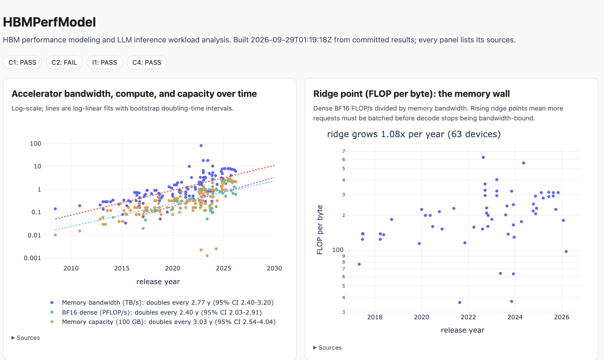
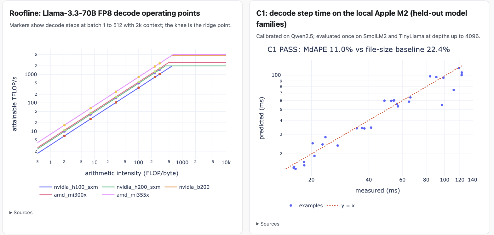

# HBMPerfModel

HBM performance modeling and LLM inference workload analysis.

HBMPerfModel turns cited HBM and accelerator specifications into first-order predictions of LLM inference bandwidth, latency, and throughput, grounds them in a timing-checked HBM pseudo-channel simulator, validates them against local measurements and public industry benchmarks, and turns public hardware data into trend and architectural-intercept analysis.

**Live dashboard:** https://uday1o1.github.io/hbm-perf-model/dashboard/



## Results at a glance

| Claim | Verdict | Evidence |
| --- | --- | --- |
| C1: calibrated decode step time on held-out model families (local Apple M2, llama.cpp) | **PASS** | 11.0% median error (95% CI 7.6-13.2%) vs 22.4% for a calibrated file-size baseline and 68.4% uncalibrated |
| C2: calibrated TPOT on held-out accelerators (B200, MI325X, MI355X; InferenceX) | **FAIL** (predeclared baseline clause) | 19.1% median error, within the 35% threshold, but no better than scaling calibration TPOT by HBM bandwidth (18.9%) |
| I1: MLPerf Llama2-70B Offline results stay below the dense compute bound | **PASS** | 98 rows, 0 violations; systems reach a median 22% of dense peak |
| C4: simulator agrees with Ramulator 2 on identical traces | **PASS** | bandwidth within 0.2-3.7%, row-hit rate within 0.001 |
| C5: simulator golden tests and timing-checker fault injection | **PASS** | every seeded timing violation caught, negative controls clean |

Other findings (details in [docs/RESULTS.md](docs/RESULTS.md)):

- Memory bandwidth doubles every 2.8 years, dense BF16 compute every 2.4, capacity every 3.0; the FLOP-per-byte ridge point keeps rising (Epoch AI data, bootstrap intervals).
- Higher HBM pin rates help streaming but not fine-grained access: simulated random-read efficiency falls from 44% (HBM2) to 20% (HBM3E) because activation limits are fixed in nanoseconds.
- One-token paged KV blocks cost 12-30% HBM efficiency versus 16-token blocks, and the penalty grows with data rate.
- KV offload over NVLink-C2C raises feasible batch but only helps throughput at small fractions and only if tier reads overlap HBM reads (model-only).



## What is inside

| Component | Module | Role |
| --- | --- | --- |
| Cited catalogs | `data/catalog/*.csv`, `hbmperf.catalog` | Accelerators (dense peaks), HBM and DRAM standards, DRAM timing presets, model architectures, memory tiers, CSP instances; unit-suffixed columns and HTTPS sources |
| HBM simulator | `hbmperf.dram` | Event-driven pseudo-channel model with FR-FCFS, refresh, write drain, address mapping, traffic generators, and an independent command-log timing checker |
| First-order LLM model | `hbmperf.llm` | Exact byte and FLOP accounting (GQA, tied embeddings, MoE, tensor parallelism, KV capacity), roofline step time, TTFT, TPOT, critical batch |
| Validation | `hbmperf.validate` | C1 (llama-bench), C2 (InferenceX), I1 (MLPerf) with cluster-bootstrap statistics and predeclared verdicts |
| Hierarchy and clusters | `hbmperf.hierarchy` | KV or weight offload bounds, CSP instance throughput |
| Trends | `hbmperf.trends` | Growth fits and intercept years with bootstrap intervals |
| Dashboard | `hbmperf.dashboard` | Static HTML at `docs/dashboard/index.html`, built only from committed results |
| Host benchmarks | `bench/host` | C pointer-chase latency and multithreaded bandwidth |
| Cross-check | `tools/ramulator_crosscheck` | Pinned Ramulator 2 build and identical-trace comparison |

## Quick start

Requires Python 3.11+ and [uv](https://docs.astral.sh/uv/).

```bash
uv sync
uv run pytest -q
uv run hbmperf llm predict --model llama-3.3-70b --device nvidia_h200_sxm --precision fp8 --tp 2 --batch 16
uv run hbmperf dram sim --preset hbm3_6400 --pattern kv_gather --kv-block-bytes 65536
uv run hbmperf hierarchy sweep --device nvidia_gh200_hbm3e --tier gh200_c2c_lpddr5x
uv run hbmperf trends intercepts
uv run hbmperf validate local
uv run hbmperf dashboard build
```

Example prediction:

```text
llama-3.3-70b on nvidia_h200_sxm (fp8, tp=2, batch=16, isl=1024, osl=128)
  feasible:          True
  TPOT:              9.230 ms (memory-bound)
  throughput:        1733.4 tok/s total, 866.7 tok/s/device, 108.3 tok/s/sequence
  critical batch B*: 419.6
```

Reproducing measurements needs llama.cpp (`brew install llama.cpp`); the Ramulator 2 cross-check needs CMake and Python 3.14 (`tools/ramulator_crosscheck/build.sh`).
Every command and protocol is in [docs/METHODOLOGY.md](docs/METHODOLOGY.md).

## How the claims were protected

- Thresholds, baselines, splits, and support floors were written into [BUILD_PLAN.md](BUILD_PLAN.md) and audited before any evaluation data existed.
- Calibration and evaluation are split by model family (C1) and by accelerator (C2); code and calibration were frozen at a tag before the evaluation split was measured once.
- Model files are pinned by SHA-256; external datasets are hash-verified snapshots; each report records a hash of every module, catalog row, and data file it depends on, and `hbmperf validate local --status` flags a stale result.
- Failing results are reported as failing (C2), with the predeclared fallback claim.

## Limitations

Local measurements come from one Apple M2 and say nothing direct about HBM; datacenter validation relies on third-party published results; the simulator's HBM timings are open-source estimates, not vendor data; hierarchy, cluster, and trend-intercept results are model-only extrapolations.
See [docs/LIMITATIONS.md](docs/LIMITATIONS.md).

## Data sources and licenses

Code is MIT-licensed.
Hardware specifications come from vendor datasheets and JEDEC releases (cited per row).
Trend data: Epoch AI, "Machine Learning Hardware" (Creative Commons Attribution).
Benchmarks: MLCommons MLPerf Inference results (Apache-2.0) and the SemiAnalysis InferenceX public API (derived statistics only).
DRAM timing presets: Ramulator 2 (MIT).
Models measured: Qwen2.5, SmolLM2, TinyLlama GGUF files (Apache-2.0), not redistributed.
